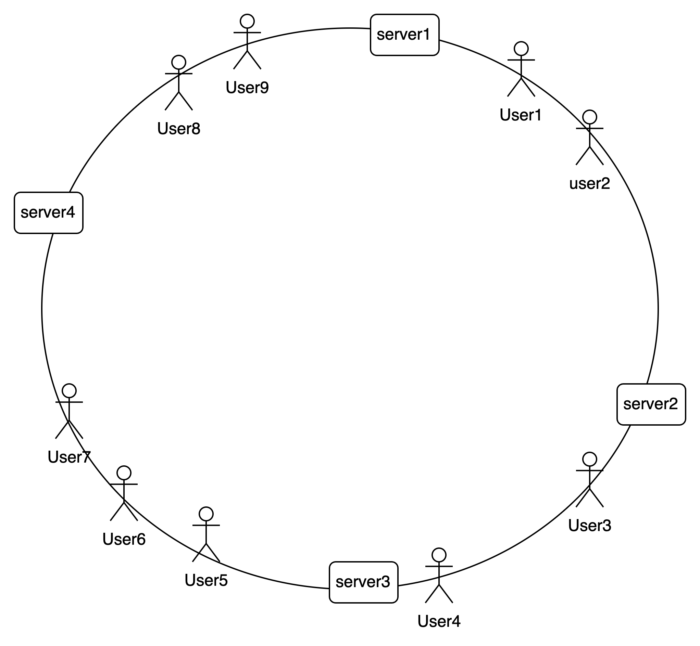
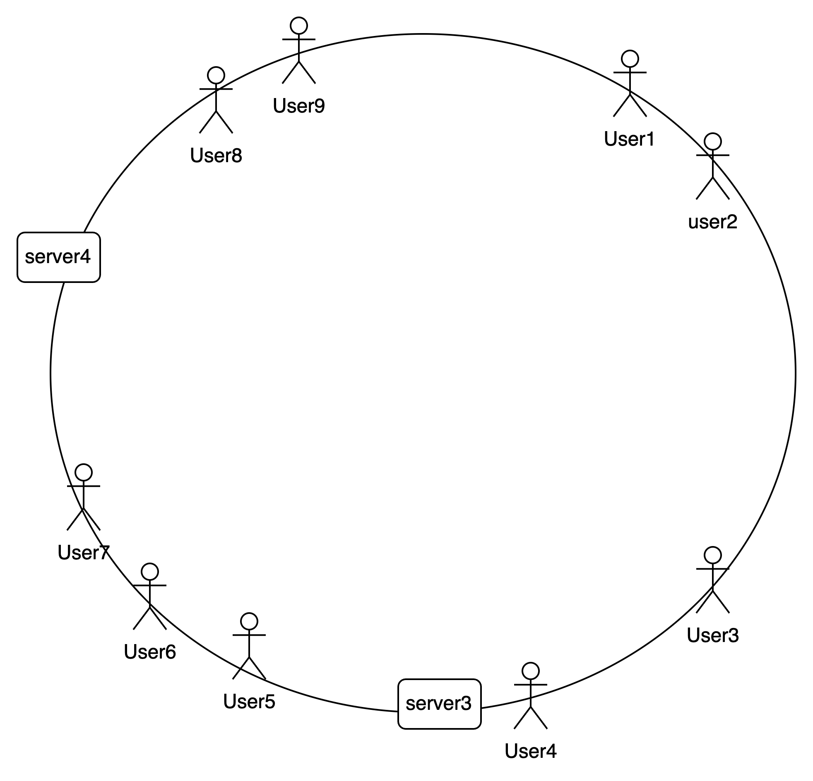
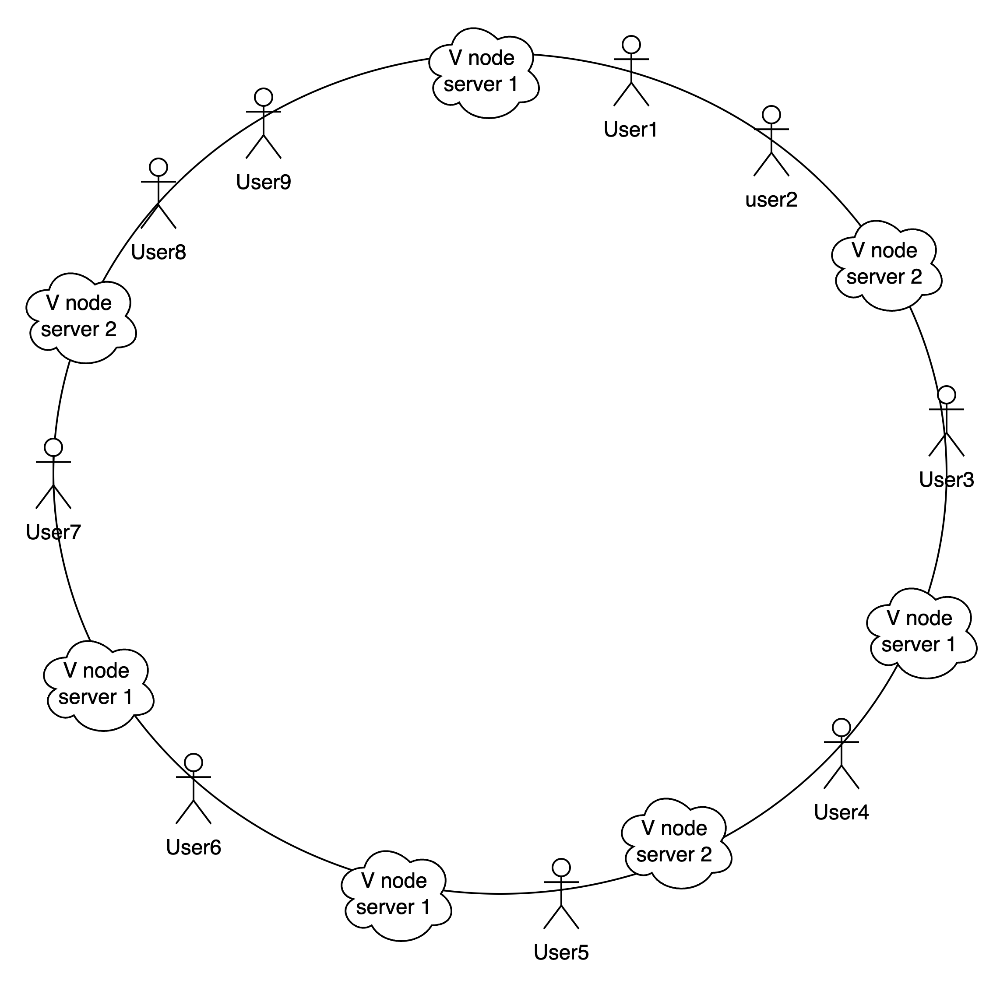

## Building Your Own Load Balancer

### Understanding Load Balancing

A load balancer serves several critical functions in a network infrastructure:

* Efficiently distributes client requests or network load across multiple servers.
* Ensures high availability and reliability by directing requests only to online servers.
* Provides scalability by enabling the addition or removal of servers based on demand.

## Types of Load Balancing

Load balancing strategies typically fall into two categories:

### Static Load Balancing:

Static load balancing does not consider the real-time state of backend servers. It simply distributes requests evenly or based on predefined rules. Common static algorithms include:

* Round-robin: Rotates requests evenly among backend servers.
* Weighted round-robin: Allows for different weights to balance server loads.
* IP hash: Utilizes client IP addresses to determine server assignments.

### Dynamic Load Balancing:

Dynamic load balancing adjusts server assignments based on real-time server conditions. Key dynamic algorithms include:

* Least connection: Routes requests to servers with the fewest open connections.
* Weighted least connection: Balances loads based on server capacity and current connections.
* Weighted response time: Directs requests to servers with the lowest average response time.
* Resource-based: Considers server resource usage (CPU, memory, etc.) when distributing requests.

## Planning the Implementation

Before diving into coding, it's crucial to outline the system requirements and design:

* Develop a load balancer capable of managing traffic to multiple servers.
* Implement health checks to monitor server status.
* Handle server failures and recoveries gracefully.

### Tech Stack and Implementation Approach

For the load balancer, we'll use Java with Spring Web Flux for its asynchronous capabilities. Backend servers can be simple Python web servers. Here's an overview of the planned implementation:

1. **Controller Class**: Define endpoints for load balancing, adding servers, and removing servers.
2. **Data Structure**: Choose a suitable structure to store and retrieve backend servers efficiently. We'll use a circular linked list for its simplicity and effectiveness.
3. **Initialization**: Initialize server lists from a config file or allow servers to register dynamically.
4. **Health Checks**: Implement a background thread to periodically check server health and update the server list accordingly.
5. **Load Balancing Logic**: Use a round-robin algorithm to distribute requests among available servers.

## Code Implementation

The load balancer will periodically check the health of backend servers. If a server fails the health check, it's removed from the rotation until it becomes available again. Here's a simplified example of the health check implementation:

```java
private void startHealthCheck() {
    if (backgroundThread == null || !backgroundThread.isAlive()) {
        running = true;
        backgroundThread = new Thread(() -> {
            while (running) {
                try {
                    for (int i = 0; i < config.getAddress().size(); i++) {
                        HealthCheckRunnable runnable = new HealthCheckRunnable(restTemplate,strategy,config.getId().get(i),config.getAddress().get(i));
                        new Thread(runnable).start();
                    }
                    Thread.sleep(10000);
                } catch (InterruptedException e) {
                    Thread.currentThread().interrupt();
                    running = false;
                }
            }
        });
        backgroundThread.start();
    }
}
```
And inside HealthCheckRunnable class we have this function that will hit the backend server and perform update on the server list

```java
    @Override
    public void run() {
        String responge=null;
        try{
            responge= template.getForObject(address,String.class);
        }catch(Exception e)
        {
            logger.error(e.getMessage());
        }

        if(responge!=null)
        {
            logger.info("Server is up "+serverId);
            strategy.addBackServer(serverId);
        }
        else {
            logger.info("Calling server out "+ serverId);
            try {
                strategy.removeServer(serverId);
            } catch (Exception e) {
                logger.error(e.getMessage());
                Thread.currentThread().interrupt();

            }
        }
    }
```

This approach ensures that only healthy servers receive traffic, enhancing the reliability and efficiency of the load balancer.

In the next phase, we can explore advanced load balancing techniques, such as sticky sessions and consistent hashing, to further optimize performance and resource utilization.

## Consistent Hashing

So, while the round-robin algorithm is good for stateless backend servers, it falls short for stateful applications. In this case, it's crucial that each user's request goes to its designated backend server.

First things first, we need a reliable way to uniquely identify users.

### Unique User Identification Methods:

- **Cookies:** When a user visits a website, the server can send a unique identifier (cookie) to the user's browser, which the browser then sends back with each subsequent request. This allows the server to recognize the user.
- **Session IDs:** Servers can generate a unique session ID for each user session. This ID is typically stored either in a cookie or appended to URLs and is used to associate subsequent requests with the same session.
- **IP Address:** Though not completely reliable due to dynamic IP assignments and shared networks (like in the case of proxies), the IP address can be used to identify a user. However, this method alone is not sufficient for accurate user identification.
- **User Accounts:** Users can create accounts on the website, and upon logging in, they provide unique credentials (such as username and password) which the server can use to identify them for subsequent requests.
- **Browser Fingerprinting:** Various attributes of the user's browser and device can be combined to create a unique identifier, such as the user-agent string, screen resolution, installed plugins, etc. However, this method is not always accurate and can be affected by privacy settings and browser configurations.
- **OAuth Tokens:** In scenarios where authentication is handled by a third-party service (like Google or Facebook), the web server can use OAuth tokens provided by these services to identify the user.

For our case, we'll utilize a token ID that the user will pass while hitting the load balancer.

Alright, so we have user identification squared away. Now let's address balancing these users evenly among all the backend servers.

One approach could be as simple as `(TokenID % server_list_size)`.

However, this straightforward approach has its limitations:
- It assumes even distribution of token IDs.
- It doesn't account for frequent server failures.

So, let's delve into the concept of consistent hashing.

### The Hash Ring

Visualize a ring where both servers and users are placed using the same hashing function. Each user is then assigned to the server immediately next on the ring going clockwise.



Seems good, right? We can evenly distribute the load without any issue. But hold on, what if a server goes down?



In such a scenario, all users on the failed server get reassigned to the next available server. This can lead to skewed load distribution.

To tackle this, we introduce virtual nodes. By breaking down the server's space into smaller chunks and distributing them across the ring with virtual nodes, we can ensure uniform load distribution even when servers fail.



So, whenever a server goes down, its users get reassigned in a uniformly distributed manner.

And that, my friend, is the essence of consistent hashing within a load balancer.

Consistent Hashing isn't just about balancing web requests; it's applicable to distributing any type of load among a system of workers, whether it's serving data to multiple nodes or similar scenarios.

Now that we grasp the concept and necessity of such a system, let's dive into the exciting world of coding!

### Coding hash ring

We've decided to implement the MD5 hashing algorithm to generate unique hashes for all our virtual servers. While it's acknowledged that MD5 can potentially produce collisions, we're accepting this risk for the sake of simplicity. 
Given the scale at which we're operating, the likelihood of collisions is extremely low, making it a reasonable trade-off for our needs.
```java
 private long generateHash(String key) {
        try{
            lock.lock();
            md.reset();
            md.update(key.getBytes());
            byte[] digest = md.digest();
            long hash = ((long) (digest[3] & 0xFF) << 24) | ((long) (digest[2] & 0xFF) << 16) | ((long) (digest[1] & 0xFF) << 8) | ((long) (digest[0] & 0xFF));
            return hash;
        }finally {
            lock.unlock();
        }
    }
```
Now for the hash ring and fetching the immediate next server on the ring. Store them in a sorted manner and then get the immediate next value for a given value.

To efficiently implement the functionality of finding the immediate next server on the hash ring, we can utilize a TreeMap data structure in Java. TreeMap stores key-value pairs in sorted order based on the natural ordering of its keys or a custom comparator provided at the time of creation. We'll store the hash values of servers as keys and the corresponding server information as values. 
This allows us to quickly find the next server hash given a particular hash value.
```java
    @Override
    public BackendServer getServer(String key) {
        try{
            lock.lock();
            logger.info("Get server called for key "+ key);
            if (serverRing.isEmpty()) {
                logger.error("Hash ring is empty");
                throw new RuntimeException("Server list is empty");
            }
            long hash = generateHash(key);
            if (!serverRing.containsKey(hash)) {
                SortedMap<Long, BackendServer> tailMap = serverRing.tailMap(hash);
                hash = tailMap.isEmpty() ? serverRing.firstKey() : tailMap.firstKey();
                logger.info("Returning server "+serverRing.get(hash)+" for the key "+key);
            }
            return serverRing.get(hash);
        }finally {
            lock.unlock();
        }
    }
```

With this we finally complete our journey of developing our own load balancer.
In this we added functionality for both using a simple round-robin algorithm or using a much scalable algorithm like consistent hashing.

You can toggle the balancing algorithm in the application.properties file by passing either ConsistenHashing or RoundRobing to strategy.name property.

So I believe that there are many things that can be improved in this. be it with how i am handling locking or handling asynchronous request to the server.

I invite you to share your insights and suggestions to enhance our load balancer further, ensuring it operates seamlessly and efficiently in diverse scenarios.
Peace out!!
